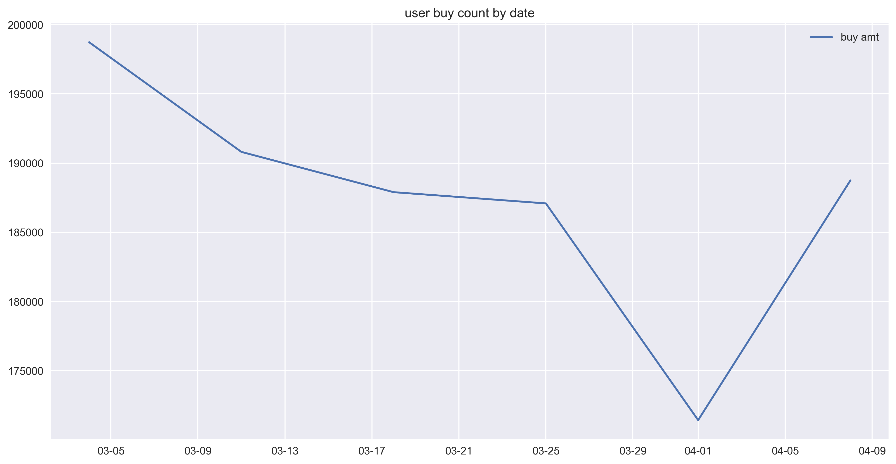
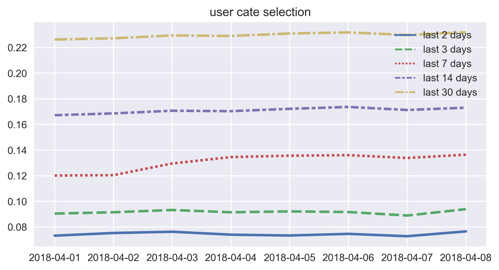
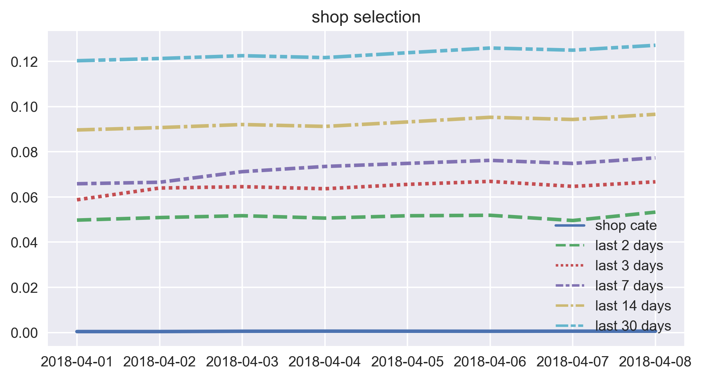
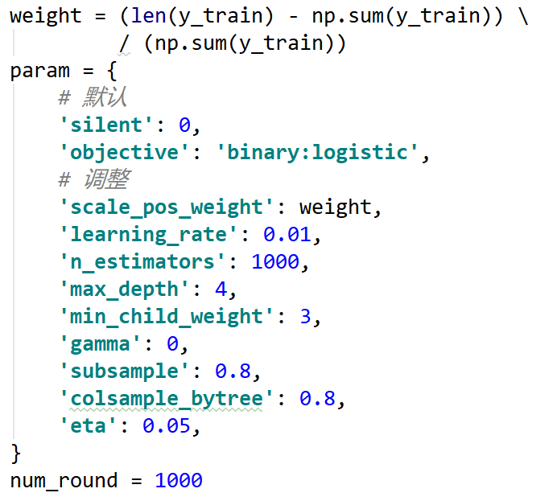

用户品类下店铺的预测（data-mining）
详细信息见 [比赛官方说明](https://jdata.jd.com/html/detail.html?id=8)
# 1. 数据处理
## 1.1 填补空值
jdata_user.csv

jdata_shop.csv

处理：对日期列[shop_reg_tm]的空值填充2018-4-16 00:00:00，对其他列空值填充-1
原因：京东提供数据对未知也用-1填充；xgboost可以通过指定空值数值，对其进行训练

## 1.2 处理无效数据
### 1.2.1 user表：
1. 删除user表中没有任何行为的用户;
2. 计算用户注册时间user_reg_tm距离预测日期的天数，作user_reg_day列的值添加到user表中。计算距离预测日期的月数，作为user_reg_month列的值添加到user表中；计算距离预测日期的年数，最为user_reg_year列的值添加到user表中。
3. 删除user表中的user_reg_time列；
### 1.2.2 product表：
1. 删除product表中没有被操作(浏览、下单、关注、评论、加购物车)过的品类；
2. 将品类上市时间market_time同原user表中的用户注册时间进行相同的操作，增加product_month列和product_列；
3. 删除product表中的market_time列；
### 1.2.3 shop表：
1. 删除shop表中没有品类的店铺；
2. 将shop表中的cate类别列改名为shop_cate列；
3. 将店铺开店时间shop_reg_tm同原user表中的用户注册时间进行相同的操作，增加shop_reg_day、shop_reg_month和shop_reg_year列；
4. 删除shop表中的shop_reg_tm列；
### 1.2.4 comment表：
1. 删除comment中对不存在的品类的评论；
### 1.2.5 action表:
1. 删除action表中操作的品类和用户不存在的行为；

处理无效数据结果：


# 2. 数据分析
## 2.1 用户购买数量
以日为单位，对购买行为进行计数，绘制折线图

分析：
1. 2月购买行为异常(猜测可能是受春节影响)，因此去除2月的数据

## 2.2 用户品类(店铺)预测数量
以7天为单位，统计每七天中user_cate出现的数量，绘制折线图

注释：取均值，用于后面预测user_cate时根据概率排序进行筛选。

## 2.3 用户品类预测与历史行为关系
统计前几天行为在预测用户品类结果中所占比例，绘制折线图

注释：用于构建用户品类模型训练集测试集和提交集的样本
结论：权衡复杂度和预测得分，30天具有最好的预测效果


## 2.4 用户品类店铺预测与历史行为关系
统计历史多少天行为可能影响预测用户品类店铺结果


注释：用于构建用户品类店铺模型训练集测试集和提交集的样本
结论：权衡复杂度和预测得分，30天具有最好的预测效果


# 3. 模型
## 3.1 想法：
uc+ucs，
即首先对用户品类进行预测；
基于用户购买品类对店铺进行预测，
然后对两类模型进行融合
## 3.2 选用模型
采用滑动窗口结合xgboost来进行预测，
1. xgboost 借助 OpenMP，能自动利用单机 CPU 的多核进行并行计算。xgboost 的
并行是在特征粒度上的。
2. xgboost 自定义了一个数据矩阵类 DMatrix，会在训练开始时进行一遍预处理，
从而提高之后每次迭代的效率。
3. xgboost 在代价函数里加入了正则项，用于控制模型的复杂度。正则项里包含
了树的叶子节点个数、每个叶子节点上输出的 score 的 L2 模的平方和，使学
习出来的模型更加简单，防止过拟合。
4. 剪枝：XGBoost 先从顶到底建立所有可以建立的子树，再从底到顶反向进行
剪枝。比起 GBM，这样不容易陷入局部最优解。

## 3.3 问题与方案
### 问题1：
由于数据集较大，如果所有特征均从原数据表中直接进行运算提取然后融合，在64G内存的服务器上依据会造成内存溢出问题
### 解决方案1：
1. 按照设计的特征划分action数据，保存其子数据集，从而加快读写速度。
2. 事先生成所需全部特征的缓存(即保存为csv格式)，构建数据集时直接从缓存加载。
### 问题2：
由于正负样本不均衡问题，如果采用二分类类别为目标函数，即预测结果由0,1构成，可能会导致预测结果过少
### 解决方案2：
1. 通过调节scale_pos_weight参数以增加正样本的权重。
2. 采用二分类概率为目标函数，即预测结果为1的概率，从而可以得到所有样本的预测结果，避免预测结果不足的问题
3. 复现京东计分函数来进行预测结果的筛选。根据数据分析中对user_cate的数量分析，选取平均值18万上下10万中最优的得分行数作为提交的预测行数。

## 3.5 具体过程
### 3.5.1 预测用户品类
1. 划分训练集，测试集如下：
2. 根据预测与历史行为关系分析，选取历史30天的行为构建可能发生购买的样本集，
3. 设计并融合如下特征
用户特征：
-  用户年龄特征
-  用户性别
-  用户等级特征
-  用户地点特征(城市等级/城市/县/省)
-  注册时间与截止日期的时间间隔（年/月/日）
-  用户的重复购买率
-  用户前 1/2/3/7/14/30 天 5 种行为 0/1 提取
-  用户前 1/2/3/7/14/30 天5种行为次数
-  用户各行为/总行为的比值
-  用户购买行为的转化率（行为2/行为1 、行为2/行为3 、行为2/行为4、行为2/行为5）
-  用户前 1/2/3/7/14/30 天5种行为天数
-  用户最近一次行为的时间距离当前日期的时间(小时)
-  用户最远一次行为的时间距离当前日期的时间(小时)
-  用户最近一次行为的行为次数

品类特征
-  品类类别特征独立编码
-  品类的重复购买率
-  品类前 1/2/3/7/14/30 天 5 种行为 0/1 提取
-  品类前 1/2/3/7/14/30 天5种行为次数
-  品类各行为/总行为的比值
-  品类购买行为的转化率（行为2/行为1 、行为2/行为3 、行为2/行为4、行为2/行为5）
-  品类前 1/2/3/7/14/30 天5种行为天数
-  品类最近一次行为的时间距离当前日期的时间(小时)
-  品类最远一次行为的时间距离当前日期的时间(小时)
-  品类最近一次行为的行为次数

用户品类特征
-  用户品类的重复购买率
-  用户品类前 1/2/3/7/14/30 天5种行为 0/1 提取
-  用户品类前 1/2/3/7/14/30 天5种行为次数
-  用户品类各行为/总行为的比值
-  用户品类购买行为的转化率（行为2/行为1 、行为2/行为3 、行为2/行为4、行为2/行为5）
-  用户品类前 1/2/3/7/14/30 天5种行为天数
-  用户品类最近一次行为的时间距离当前日期的时间(小时)
-  用户品类最远一次行为的时间距离当前日期的时间(小时)
-  用户品类最近一次行为的行为次数
-  用户关注或加购该品类，但是不购买，且加购或关注天数距离最后日期小于 10 天的记为 1，否则记为 0

用value_counts()去除只有1个值的无效特征。示例如下：     


-  由于gridsearchcv对于大数据集速度极慢，所以采用坐标下降的方法，按照影响程度从大到小进行每个参数的网格搜索，示例过程如下，
最后得到的最优参数如下，



-  设置最优模型参数并训练，用训练好的模型对测试集样本进行预测得到购买概率，通过京东计分函数得到得分最高的行数160000。
-  对提交集进行预测并选取概率最高的160000行，作为店铺预测的输入。


### 3.5.2 预测用户品类下店铺
1. 划分训练集，测试集如下：
2. 选取历史30天的行为构建可能发生购买的样本集。
3. 设计并融合如下特征
用户特征：
-  用户年龄特征
-  用户性别
-  用户等级特征
-  用户地点特征(城市等级/城市/县/省)
-  注册时间与截止日期的时间间隔（年/月/日）
-  用户的重复购买率
-  用户前 1/2/3/7/14 天 5 种行为 0/1 提取
-  用户前 1/2/3/7/14 天5种行为次数
-  用户各行为/总行为的比值
-  用户购买行为的转化率（行为2/行为1 、行为2/行为3 、行为2/行为4、行为2/行为5）
-  用户前 1/2/3/7/14 天5种行为天数
-  用户最近一次行为的时间距离当前日期的时间(小时)
-  用户最远一次行为的时间距离当前日期的时间(小时)
-  用户最近一次行为的行为次数

店铺特征
-  店铺的重复购买率
-  店铺前 1/2/3/7/14 天 5 种行为 0/1 提取
-  店铺前 1/2/3/7/14 天5种行为次数
-  店铺各行为/总行为的比值
-  店铺购买行为的转化率（行为2/行为1 、行为2/行为3 、行为2/行为4、行为2/行为5）
-  店铺前 1/2/3/7/14 天5种行为天数
-  店铺最近一次行为的时间距离当前日期的时间(小时)
-  店铺最远一次行为的时间距离当前日期的时间(小时)
-  店铺最近一次行为的行为次数

用户店铺特征
-  用户店铺的重复购买率
-  用户店铺前 1/2/3/7/14 天5种行为 0/1 提取
-  用户店铺前 1/2/3/7/14 天5种行为次数
-  用户店铺各行为/总行为的比值
-  用户店铺购买行为的转化率（行为2/行为1 、行为2/行为3 、行为2/行为4、行为2/行为5）
-  用户店铺前 1/2/3/7/14 天5种行为天数
-  用户店铺最近一次行为的时间距离当前日期的时间(小时)
-  用户店铺最远一次行为的时间距离当前日期的时间(小时)
-  用户店铺最近一次行为的行为次数
-  用户关注或加购该店铺，但是不购买，且加购或关注天数距离最后日期小于 10 天的记为 1，否则记为 0

 品类店铺特征
-  品类店铺的重复购买率
-  品类店铺前 1/2/3/7/14 天5种行为 0/1 提取
-  品类店铺前 1/2/3/7/14 天5种行为次数
-  品类店铺各行为/品类总行为的比值
-  品类店铺购买行为的转化率（行为2/行为1 、行为2/行为3 、行为2/行为4、行为2/行为5）
-  品类店铺前 1/2/3/7/14 天5种行为天数
-  品类店铺最近一次行为的时间距离当前日期的时间(小时)
-  品类店铺最远一次行为的时间距离当前日期的时间(小时)
-  品类店铺最近一次行为的行为次数

 用户品类店铺特征
-  用户品类店铺的重复购买率
-  用户品类店铺前 1/2/3/7/14 天5种行为 0/1 提取
-  用户品类店铺前 1/2/3/7/14 天5种行为次数
-  用户品类店铺各行为/总行为的比值
-  用户品类店铺购买行为的转化率（行为2/行为1 、行为2/行为3 、行为2/行为4、行为2/行为5）
-  用户品类店铺前 1/2/3/7/14 天5种行为天数
-  用户品类店铺最近一次行为的时间距离当前日期的时间(小时)
-  用户品类店铺最远一次行为的时间距离当前日期的时间(小时)
-  用户品类店铺最近一次行为的行为次数
-  用户品类关注或加购该店铺，但是不购买，且加购或关注天数距离最后日期小于 10 天的记为 1，否则记为 0
用value_counts()去除只有1个值的无效特征。

4. 进行每个参数的网格搜索，最后得到的最优参数。
6. 以用户品类的预测结果作为输入，预测结果按照用户在不同品类下对所有店铺购买的概率值排名，
取每个用户品类所有店铺的最高概率值作为店铺的预测，完成提交结果。


# 4. 改进
## 4.1模型融合
虽然xgboost是数据挖掘比赛的一项利器，但是还是有着美中不足的地方，例如在本次比赛中（结合本次比赛的具体内容拓展）
- 每轮迭代时，都需要遍历整个训练数据多次。如果把整个训练数据装进内存则会限制训练数据的大小；如果不装进内存，反复地读写训练数据又会消耗非常大的时间。
- 预排序方法（pre-sorted）：首先，空间消耗大。这样的算法需要保存数据的特征值，还保存了特征排序的结果（例如排序后的索引，为了后续快速的计算分割点），
这里需要消耗训练数据两倍的内存。其次时间上也有较大的开销，在遍历每一个分割点的时候，都需要进行分裂增益的计算，消耗的代价大。
- 对cache优化不友好。在预排序后，特征对梯度的访问是一种随机访问，并且不同的特征访问的顺序不一样，无法对cache进行优化。
同时，在每一层长树的时候，需要随机访问一个行索引到叶子索引的数组，并且不同特征访问的顺序也不一样，也会造成较大的cache miss。
- 带深度限制的Leaf-wise的叶子生长策略
- Leaf-wise的缺点：可能会长出比较深的决策树，产生过拟合。
采用stacking lightGBM可以有效的弥补xgboost的缺点
因此LightGBM在Leaf-wise之上增加了一个最大深度限制，在保证高效率的同时防止过拟合。


# 5.配置
## 5.1环境
1. Ubuntu 64G Memory
## 5.2步骤
1. 将原数据放至data/ori

## 5.3统计规律
- 每个用户都至少购买过一次
- 2月23日前7天购买用户人数异常
-  数据分箱结果变差
- cart 最早出现日期 04-08

## 5.4参考
- jdata 思路
```txt
https://blog.csdn.net/weixin_42182923/article/details/82432717
```
- jdata 代码
```txt
https://github.com/hecongqing/2017-jdata-competition
https://github.com/foursking1/jd
https://zhuanlan.zhihu.com/p/26177617
```
- xgboost 调参
```txt
https://blog.csdn.net/mmc2015/article/details/51019894
https://xgboost.readthedocs.io/en/latest/parameter.html#general-parameters
https://wuhuhu800.github.io/2018/02/28/xgboost_parameters/
https://blog.csdn.net/han_xiaoyang/article/details/52665396
https://blog.csdn.net/SzM21C11U68n04vdcLmJ/article/details/78516866
```

- xgboost 官方文档
```txt
https://xgboost.readthedocs.io/en/latest/python/python_intro.html
```

- xgboost 代码
```txt
https://github.com/dmlc/xgboost/tree/master/demo/guide-python
https://github.com/dmlc/xgboost/tree/master/tests/python
https://zhuanlan.zhihu.com/p/31182879
```

- python画图
```txt
https://matplotlib.org/gallery/index.html
https://seaborn.pydata.org/tutorial.html
http://liyangbit.com/pythonvisualization/matplotlib-top-50-visualizations/#20-%E8%BF%9E%E7%BB%AD%E5%8F%98%E9%87%8F%E7%9A%84%E7%9B%B4%E6%96%B9%E5%9B%BE-histogram-for-continuous-variable
```

- pandas大数据
```txt
https://blog.csdn.net/weiyongle1996/article/details/78498603
```

- pandas参数
```txt
https://blog.csdn.net/u010801439/article/details/80033341
```

- pandas报错
```txt
https://zhuanlan.zhihu.com/p/41202576
```

- 样本不平衡
```txt
https://blog.csdn.net/pearl8899/article/details/80820067
https://blog.csdn.net/u012735708/article/details/82877501
```


## 5.5依赖配置
```txt
certifi==2019.3.9
chardet==3.0.4
cycler==0.10.0
docopt==0.6.2
idna==2.8
kiwisolver==1.1.0
matplotlib==3.0.3
numpy==1.16.3
pandas==0.24.2
pyparsing==2.4.0
python-dateutil==2.8.0
pytz==2019.1
requests==2.21.0
scikit-learn==0.20.3
scipy==1.2.1
six==1.12.0
urllib3==1.24.3
wincertstore==0.2
xgboost==0.82
yarg==0.1.9
```
